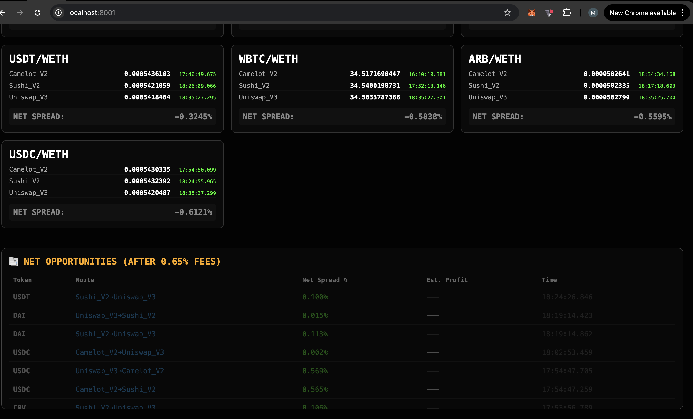
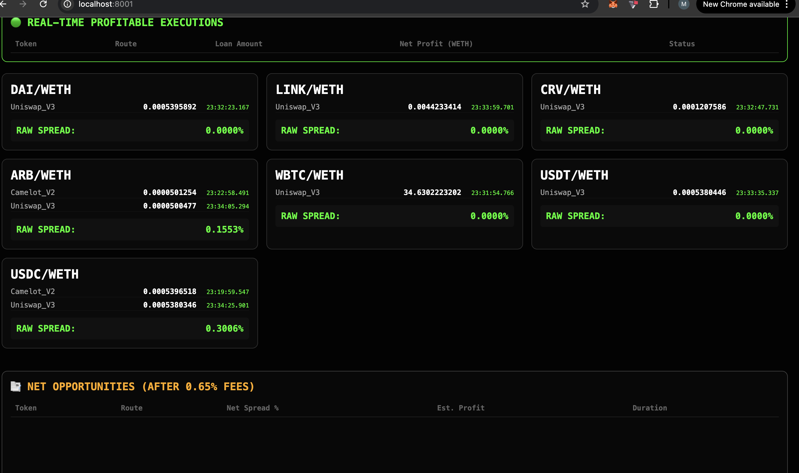
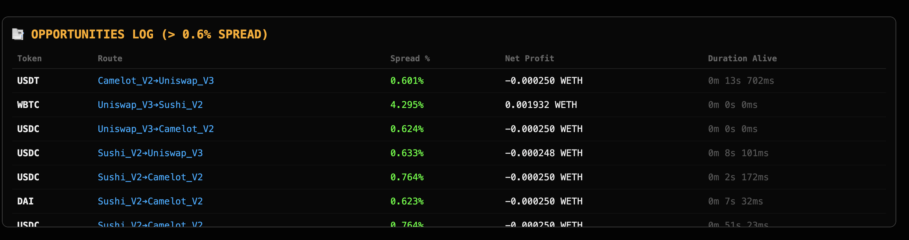

# flashloandexprototype1

# Flash Loan Arbitrage Bot

**Working Prototype** of a Flash Loan Arbitrage Scanner and Executor for major DEXes.

### 📋 Project Status
This is a **fully functional prototype**.  
The bot is already working: it scans the market in real-time, finds profitable arbitrage opportunities and shows them clearly in a beautiful dashboard. Flash loan execution logic is implemented and ready for testing.

### 🏗 What the Bot Does
- Continuously analyzes data from **Uniswap, SushiSwap and other DEXes**
- Detects arbitrage opportunities across different pools and chains
- Calculates potential profit (after gas and fees)
- Displays all opportunities in a clean, real-time Dashboard
- Can execute flash loans through Aave / Uniswap when you confirm the trade

### ✨ Key Features
- Real-time multi-DEX scanner
- Accurate profitability calculator
- Interactive Dashboard (live opportunities list, charts, filters)
- Flash loan executor (prototype mode)
- Gas optimization and slippage protection
- Logging of all detected opportunities

#### 📸 Screenshots

**Main Dashboard** :

**Logs View** :

### 🛠 Technologies
- Backend Scanner: Python / Node.js
- Flash Loan Contracts: Solidity
- Frontend Dashboard: React + Tailwind CSS
- Blockchain interaction: Web3.py / ethers.js
- Real-time updates: WebSocket

##### Details!!!:

- This is just a prototype, not real-world, but very suitable for testing. I can't share the full working version with you; the code I'm sharing is just an experimental prototype in the development phase of the real version. Even in this state, it works quite well. I'm putting it here so you can see it and understand my experience in this field. It has a very simple and understandable dashboard, showing current market prices and last update times, and of course, simulated trades. This code is just a backend; the logic is designed so that it performs all the calculations and analyses from here and then sends them to a smart contract, which then performs real arbitrage with real money. I can even write a smart contract in Solidity, but I won't share that here. Have a good day.
